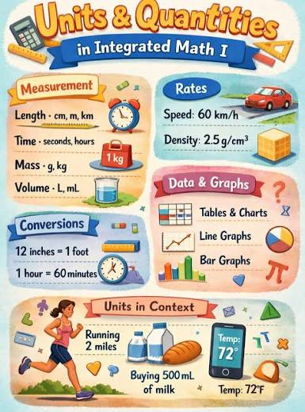
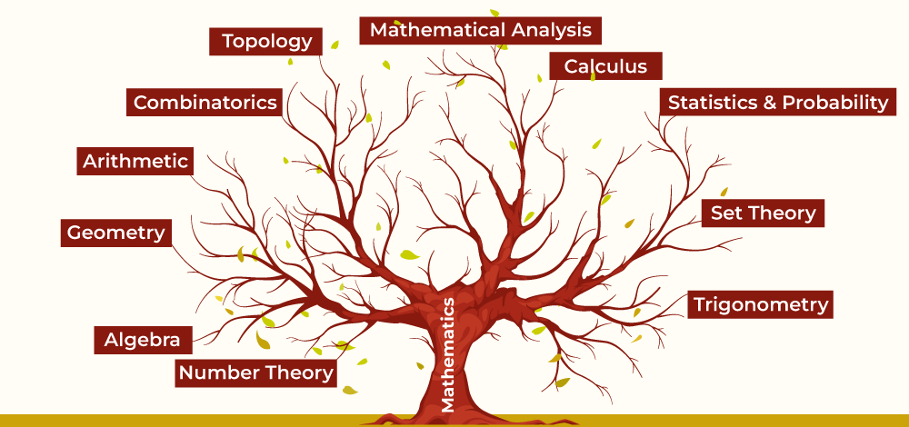
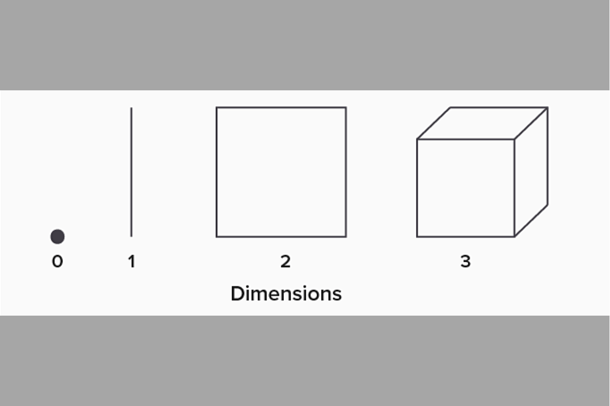
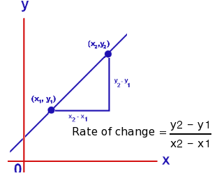
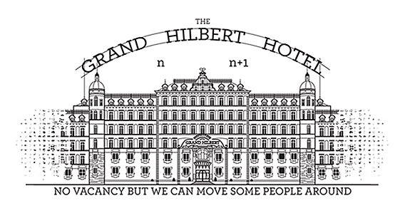

# Module overview

This module provides an overview of fundamental concepts in number, logic, and mathematical reasoning. We'll explore the principles of deductive and inductive reasoning, and begin to develop a foundation for understanding logical arguments and mathematical proofs.

We'll also explore concepts such as quantity, structure, space, and change, which form the basis of the various mathematical disciplines. Special attention is given to the concepts of zero and infinity, their historical development, and their significance in mathematical thinking.

# Notes

## The concept of sets

A set is a well-defined collection of distinct objects. A set is considered as an object in its own right. Sets are foundational in mathematics because they provide a way to group and classify numbers, objects, or ideas. The items inside a set are called the set's elements.

::: callout-tip
### Elements

An element is an object or item in a set.

For example, for $A = \{1, 3, 5\} \text{ and } B = \{2, 4, 6\}$, we say $3 \in A$ and $4 \in B$.
:::

If an element $a$ is in set $A$, we write $a \in A$.

If a is not in $A$, we write $a \notin A$.

------------------------------------------------------------------------

::: callout-tip
### Membership

The fundamental property of sets is that elements are either members or non-members -- there is no in-between. The symbol $\in$ (epsilon) is used to denote membership.
:::

In this context, $\in$ (epsilon) means: "is an element of," "is a member of," or simply "is in."

To indicate non-membership, we use $\notin$.

For example, for the same set $A = \{1, 3, 5\}$, we write $6 \notin A$.

------------------------------------------------------------------------

::: callout-tip
### Subsets

A set $A$ is a subset of $B$ if every element of $A$ is also in $B$.

We write $A \subseteq B$ to indicate subsets.
:::

------------------------------------------------------------------------

::: callout-tip
### Operations

#### Union

The **union** of sets $A$ and $B$ is the set of all elements in $A$ or $B$:

$$
A \cup B = \{ x \mid x \in A \text{ or } x \in B \}
$$

#### Intersection

The **intersection** of sets $A$ and $B$ is the set of all elements in both $A$ and $B$:

$$
A \cap B = \{ x \mid x \in A \text{ and } x \in B \}
$$

#### Complement

The **complement** of set $A$ (relative to a universal set $U$) is the set of all elements in $U$ not in $A$:\
$$
A^{c} = \{ x \in U \mid x \notin A \}
$$
:::

------------------------------------------------------------------------

## Sets of numbers

<iframe width="1120" height="630" src="https://www.youtube.com/embed/NuYPj29z6Ko?si=XMgQpMjfWdaJ-7__" title="YouTube video player" frameborder="0" allow="accelerometer; autoplay; clipboard-write; encrypted-media; gyroscope; picture-in-picture; web-share" referrerpolicy="strict-origin-when-cross-origin" allowfullscreen>

</iframe>

------------------------------------------------------------------------

### Natural numbers

The set of **natural** numbers, $\mathbb{N} = \{1, 2, 3, ...\}$

### Whole numbers

The set of **whole** numbers, $\mathbb{N_0} = \{0, 1, 2, 3, ...\}$

### Integer numbers

The set of **integers**, $\mathbb{Z} = \{..., -3, -2, -1, 0, 1, 2, 3, ...\}$

### Rational numbers

The set of **rational** numbers, $\mathbb{Q} = \{\dfrac{a}{b}, a \in \mathbb{Z}, b \in \mathbb{Z}, b \ne 0\}$

### Real numbers

-   The set of **real** numbers, $\mathbb{R} = (-\infty, \infty)$

------------------------------------------------------------------------

### Other sets

What sets are missing? How can you define and visualize these other sets?

------------------------------------------------------------------------

## Framing mathematics and science

**Science** is the systematic study and pursuit of knowledge about the natural and physical world through observation, experimentation, and the formulation of testable hypotheses. It involves a methods-based approach to understanding phenomena and developing explanations based on empirical evidence. **Mathematics** is the science that deals with the logic of quantity, structure, space, and change.

------------------------------------------------------------------------

### Logic

Logic refers to the principles of reasoning, especially correct reasoning. It's the systematic method of coming to conclusions through rational thought. In mathematics, logic involves the formal principles of reasoning and inference used to derive valid conclusions.

------------------------------------------------------------------------

### Reasoning

-   **Deductive reasoning**: Deductive reasoning is a logical process that involves drawing specific conclusions from general premises or principles that are assumed to be true. This form of reasoning is often described as a "top-down" approach, where one starts with a general statement and applies it to a specific case. In mathematics, deductive reasoning involves using established rules, facts, and theorems to draw specific conclusions. It moves from general principles to specific instances.

    -   For example, if we know that "All fish live in water" and "Nemo is a fish," what can we conclude?

    -   Solving equations: Rule: If (x + 5 = 12), you can subtract (5) from both sides. Specific case: Your equation is (x + 5 = 12). Conclusion: (x = 7).

    -   Even numbers: Rule: All even numbers can be divided by (2) with no remainder. Specific case: (48) is an even number. Conclusion: (48) can be divided by (2) with no remainder.

------------------------------------------------------------------------

### Reasoning

-   **Inductive reasoning**: Inductive reasoning is a logical process that involves drawing general conclusions from specific observations or instances. This method is often referred to as "bottom-up" reasoning, contrasting with deductive reasoning, which moves from general principles to specific conclusions. In mathematics, inductive reasoning involves observing patterns or specific instances to form general conclusions or hypotheses.

    -   Number patterns: You see the sequence (2, 4, 6, 8, \dots) You notice each number adds (2). You guess that the next number is (10).

    -   You multiply (3 \times 5 = 15), then (7 \times 9 = 63). Both answers are odd. You guess that multiplying any two odd numbers always gives an odd number.

    -   More generally, using if-then statements.

------------------------------------------------------------------------

### Quantity

Quantity relates to the amount or number of something that can be measured or counted. In mathematics, it deals with concepts like magnitude, size, or amount that can be expressed numerically.

------------------------------------------------------------------------

### Structure

Structure in mathematics refers to the way mathematical objects are organized or arranged.

Structure involves the relationships and patterns between mathematical entities, such as the properties of number systems or the organization of geometric shapes.

------------------------------------------------------------------------

### Space

In mathematics, space refers to the framework within which points, lines, shapes, and other geometric objects exist.

Space can be two-dimensional (like a plane), three-dimensional (like our physical world), or even higher-dimensional in abstract mathematics.

------------------------------------------------------------------------

### Change

Change in mathematics deals with how quantities or properties vary or transform over time or under different conditions. This concept is fundamental to areas like calculus, which studies rates of change and accumulation.

# What do we mean by zero?

Zero is a number that represents the absence of quantity or magnitude. It is the integer between the set of all negative integers and all positive integers.

## Examples

The empty set: $\emptyset$ or $\{ \}$.

The number line: A starting point on number line.

Counting: of you have a basket of apples and remove all of the apples, you are left with zero apples.

Temperature: On the Celsius scale, zero degrees represents the freezing point of water.

# What do we mean by infinity?

Infinity is a concept describing something without any limit, and is larger than any real number. It is often denoted by the symbol $\infty$.

## Examples

The number line: You can always add 1 to any number, no matter how large, so the number line extends infinitely.

Fractional division: 1 divided by 3 results in a repeating decimal (0.333...) that goes on infinitely.

------------------------------------------------------------------------

## Key points to remember:

-   Zero as a placeholder in our number system.

-   The role of zero in mathematics (e.g., additive identity).

-   Historical developments of the concept of zero:

    -   Dividing a number by zero, $\dfrac{x}{0} = \text{undefined}$ for some number $x \neq 0$

    -   Dividing zero by zero, $\dfrac{x}{0} = \text{undefined}$ for some number $x = 0$.

-   Different types of infinity (countable and uncountable)

-   The concept of infinity in mathematics vs. everyday life

-   Paradoxes involving infinity (e.g., Hilbert's Hotel)

------------------------------------------------------------------------

## Hilbert's Hotel

*How the Paradox Works*

Imagine a hotel with a countable infinity of rooms: 1, 2, 3, 4, and so on, with no last room.

Every single room is already full.

In a normal hotel, you cannot take new guests when every room is full.

*Adding a Single New Guest*

A new traveler arrives and wants a room.

The manager asks the guest in room 1 to move to room 2.

The guest in room 2 moves to room 3, and every guest $n$ moves to room $n + 1$.

Room 1 is now empty for the new traveler, and nobody is left without a room.

This proves that infinity plus one is still just infinity.
