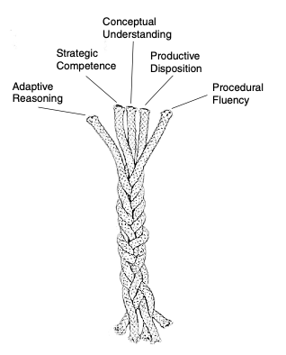
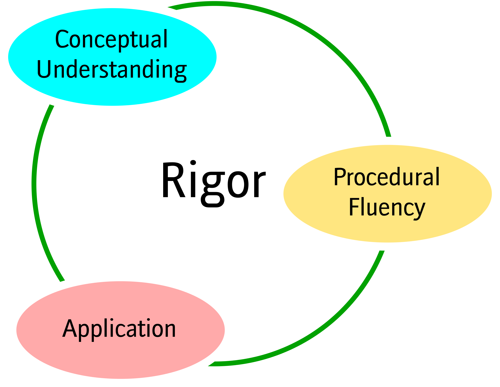
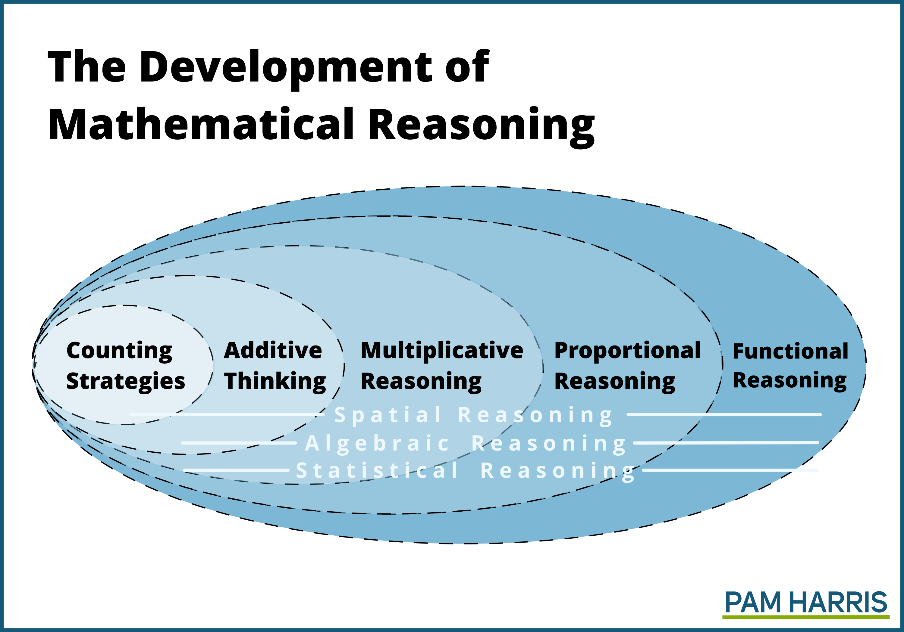
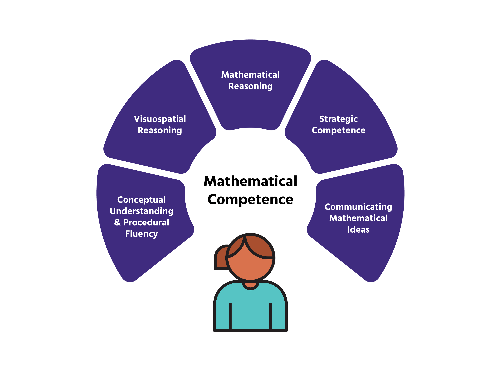

## Module Overview

This module will deepen your understanding of generating mathematical lessons with a focus on fractions and decimals.

### Goals for the module

One goal for this module is for you to come up with a set of ways to describe various ways to teach students' properties and procedural fluency. We'll use new examples and those from previous modules to guide you.

# Decimals

## Decimal Place Value

For each, underline the whole number part and circle the decimal (fractional) part.

-   2.5\
-   1.23\
-   0.52\
-   0.002

Which digit is in the tenths place? Which is in the hundredths place?

------------------------------------------------------------------------

## True or False: Decimal Equivalents

True or False: 25 hundredths is the same as 2 tenths and 5 hundredths?

-   Draw a place value chart to prove your answer.
-   Write both numbers in fraction form.

------------------------------------------------------------------------

## Comparing and Ordering Decimals

Compare which is greater by identifying the digits in each decimal place (tenths, hundredths, thousandths).

-   4.859\
-   4.869

Next, create your own set of three decimals and order them least to greatest.

------------------------------------------------------------------------

# Five Strands of Mathematical Proficiency

------------------------------------------------------------------------

{width="75%"}

Kilpatrick and colleagues (National Research Council, 2001) identified five interdependent strands that together form a comprehensive definition of mathematical proficiency.

------------------------------------------------------------------------

## Procedural Fluency

Skill in carrying out mathematical procedures flexibly, accurately, efficiently, and appropriately.

-   Involves knowing procedures and using them correctly.

-   Includes the ability to select appropriate methods and apply algorithms based on the situation.

{width="50%"}

------------------------------------------------------------------------

## Conceptual Understanding

Comprehension of mathematical concepts, operations, and relationships.

-   Means having an integrated and functional grasp of ideas, not just memorizing facts.

-   Students should connect new knowledge with what they already know and represent mathematical situations in multiple ways.

{width="50%"}

------------------------------------------------------------------------

## Adaptive Reasoning

Capacity for logical thought, reflection, explanation, and justification.

-   Enables students to explain and justify their strategies and solutions.

-   Supports the extension of knowledge from known concepts to unfamiliar situations.

{width="50%"}

------------------------------------------------------------------------

## Strategic Competence

Ability to formulate, represent, and solve mathematical problems.

-   Involves devising and using strategies for both routine and non-routine problems.

-   Encourages flexible thinking when approaching mathematical challenges.

{width="50%"}

------------------------------------------------------------------------

## Productive Disposition

Habitual inclination to see mathematics as sensible, useful, and worthwhile, paired with a belief in perseverance and personal efficacy.

-   Nurtures a positive attitude and sense of efficacy towards mathematics.

-   Students believe that effort leads to understanding and success.

{width="50%"}

------------------------------------------------------------------------

| Strand | Key Aspect | Description |
|-------------------|------------------|------------------------------------|
| Procedural Fluency | Technical Performance | Memorise and rehearse |
| Conceptual Understanding | Classification, Definition | Sort, classify, define and deduce |
|  | Representation | Describe, interpret and translate |
|  | Analysis | Explore structure, variation, connections |
| Adaptive Reasoning | Argument, Proof | Test, justify and prove conjectures |
| Strategic Competence | Mathematical Model | Formulate models and problems |
|  | Solution | Employ strategies to solve a problem |
|  | Critical Commentary | Interpret & evaluate solutions and strategies |
