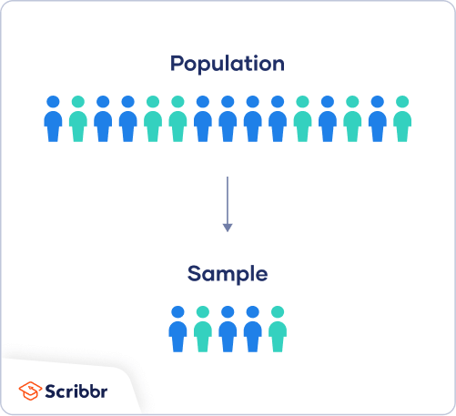
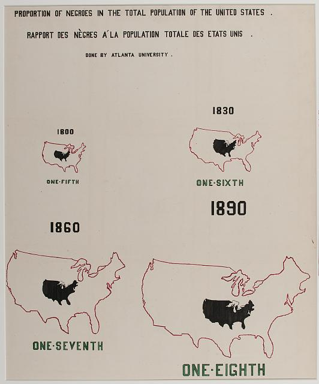
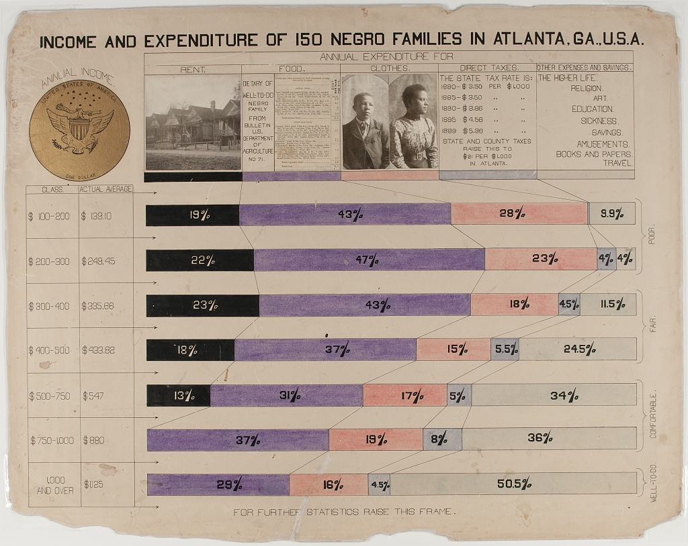

# Overview

Statistics builds upon deep mathematical concepts such as sets, numbers, and measurement. These foundations allow us to describe, collect, and analyze data effectively. Before studying data, we must understand the basic structures from which all numerical and categorical reasoning emerge.

# National Council of Teachers of Mathematics (NCTM)

Alignment with the principles from the National Council of Teachers of Mathematics (NCTM, Principles to Actions, 2014).

- Understand and describe different sets of numbers and their relationships.
- Relate sets of numbers to statistical variable types.
- Distinguish between a population and a sample in statistical terms.
- Explain data collection and measurement processes grounded in mathematical reasoning.
- Connect abstract mathematical structures to real-world data contexts.

# Sets of Numbers

As we know, mathematics is constructed upon sets — well-defined collections of elements. 

The number system builds systematically upon these sets, each expanding the possibilities of measurement when we are thinking about statistics.

$$
\mathbb{N} \subset \mathbb{Z} \subset \mathbb{Q} \subset \mathbb{R} \subset \mathbb{C}
$$

- $\mathbb{N}$: The set of natural numbers, used for counting objects.  
- $\mathbb{Z}$: The set of integers, extending natural numbers to include negatives.  
- $\mathbb{Q}$: The set of rational numbers, allowing fractional relationships.  
- $\mathbb{R}$: The set of real numbers, providing a complete continuum of measurement.  
- $\mathbb{C}$: The set of complex numbers, incorporating an imaginary component $i = \sqrt{-1}$.  

Each set expands our capacity to represent and interpret reality mathematically. In statistics, these same conceptual expansions allow for increasingly sophisticated ways to represent and analyze data.

# Number Sets and Variable Types

Statistical variables describe measurable or classifiable aspects of a population. The type of variable determines the operations that can be performed and the level of precision possible.

| Mathematical Set | Variable Type | Description | Example |
|------------------|----------------|-------------|----------|
| $\mathbb{N}$ | Discrete | Countable outcomes | Number of books, number of students |
| $\mathbb{Z}$ | Categorical Ordinal | Ordered categories, sometimes signed values | Temperature comparison, rankings |
| $\mathbb{Q}$, $\mathbb{R}$ | Continuous | Measurable quantities on an interval or ratio scale | Time, distance, height |
| Symbolic (labels) | Nominal | Unordered categories | Gender, subject area, colors |

This table shows the bridge between mathematics and statistics: number sets form a logical foundation for classifying real-world data.

# Populations and Samples

In mathematics, we often discuss universal sets and their subsets. This same idea shapes statistical reasoning through the relationship between a population and a sample. Let:

**Population**: The complete set of all individuals or observations of interest.  

$$
U = \text{universal set of all possible observations}
$$

**Sample**: A subset selected from the population for study.  

$$
S \subset U = \text{sample drawn from the population}
$$

## Population parameter

A number which summarizes the entire group.

## Sample statistic

A single number that summarizes a subset of data, or the sample.

{width="40%"}

# Data Collection and Measurement

Measurement connects the abstract and the empirical. It assigns numbers or categories to objects or events according to a defined rule. According to NCTM reasoning standards, effective data collection and measurement require:  

- A clear definition of variables.  
- Consistency in units and scales.  
- Awareness of sources of variability in data.  

Measurements can be discrete (counted) or continuous (measured), directly linked to the corresponding set structure:

$$
\text{Discrete: } x \in \mathbb{N}, \quad \text{Continuous: } x \in \mathbb{R}
$$

Real-world measurement always involves approximations; understanding the number system helps teachers explain these approximations as necessary simplifications of continuous reality.

### Types of studies and sampling strategies

The methods used to collect sample data for statistical analysis is extremely important.

If sample data are not collected appropriately, resulting statistical analyses will be futile.

As a result, planning a study by identifying *research questions*, the *population* and *sample* of interest, and selecting the appropriate *research method(s)* that will be used to *analyze data* that is collected are all essential parts in the statistical data analysis process.

------------------------------------------------------------------------

#### Understanding experimental and observational study designs

There are many different types of research studies.

Some studies use non-traditional methods (such as oral traditions) to collect data, while others focus on more traditional methods (such as surveys) to analyze data on a sample or a population.

These data collection methods produce a set of observations upon which statistical analyses can be applied. We consider two core study designs in statistical data analysis: *experimental* studies and *observational* studies.

------------------------------------------------------------------------

::: callout-DEFINITIONS
**Experimental study**: In an experimental study, a *treatment* is applied to a sample of interest to observe its effects. There is generally a control group and a treatment group used to understand the effects of the treatment. Individual observations are referred to as experimental units whereas studies involving humans are generally defined as study subjects.

**Observational study**: In an observational study, specific characteristics of a sample or population are observed and measured but individual observations or subjects of study are not influenced or modified in any way.
:::

------------------------------------------------------------------------

##### Three types of observational studies

::: {.callout-caution icon="false"}
## **DEFINITIONS**: Types of studies

**Retrospective study**: In a retrospective study, we go back in time to collect data over some past period.

**Cross-sectional study**: In a cross-sectional study, data are collected and measured at one point in time.

**Prospective study**: In a prospective study, we set up a study to go forward in time and observe groups sharing common factors.
:::

------------------------------------------------------------------------

##### Identify and describe the different sampling methods

There are two broad categories of selecting members of a population to generate sample data:

-   Probability sampling

-   Non-probability sampling

Within these two broad categories are other methods based on the needs of the study. Each methods is used to support statistical data analysis with some methods providing stronger evidence than others.

------------------------------------------------------------------------

::: {.callout-caution icon="false"}
### **Definitions**: Sampling methods

**Probability sampling**: Involves the random selection of subjects in such a way that every member of a sample has the sample probability of being selected.

**Non-probability sampling**: Involves the use of criteria to select data that is not based on an equal likelihood of selection.
:::

# Real world examples

# Reflection

Encourage students to connect these mathematical foundations to their teaching practice:  
- How can the hierarchy of number sets guide discussions of data types?  
- What set relationships help explain statistical sampling methods?  
- How can measurement be introduced through examples grounded in number theory?

